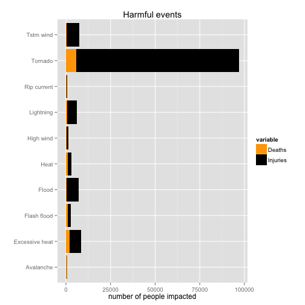
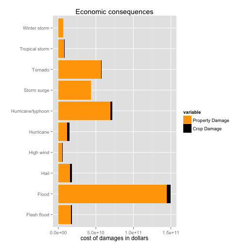

# The fatal impact of tornadoes and economic effects of floods #

## Synopsis ##

Get the data from NOAA. Analyse impact by deaths. Tornadoes come first. Analyse impact by economy. Floods come first.

## Data Processing ##

### Load ###

How the data were loaded into R


```r
fileUrl <- "https://d396qusza40orc.cloudfront.net/repdata%2Fdata%2FStormData.csv.bz2"
download.file(fileUrl, destfile = "tempdata.csv.bz2", method = "curl")
stormdata <- read.csv("./tempdata.csv.bz2")
```


### Process ###

How the data are processed for analysis


```r
library(Hmisc)
```

```
## Loading required package: grid
## Loading required package: lattice
## Loading required package: survival
## Loading required package: splines
## Loading required package: Formula
## 
## Attaching package: 'Hmisc'
## 
## The following objects are masked from 'package:base':
## 
##     format.pval, round.POSIXt, trunc.POSIXt, units
```

```r
library(reshape)
library(ggplot2)
library(car)

stormdata$EVTYPE <- capitalize(tolower(stormdata$EVTYPE))

damages <- aggregate(cbind(FATALITIES, INJURIES) ~ EVTYPE, stormdata, sum)
dam <- melt(head(damages[order(-damages$FATALITIES, -damages$INJURIES), ], 10))
```

```
## Using EVTYPE as id variables
```

```r

stormdata$PROPDMG <- stormdata$PROPDMG * as.numeric(Recode(stormdata$PROPDMGEXP, 
    "'0'=1;'1'=10;'2'=100;'3'=1000;'4'=10000;'5'=100000;'6'=1000000;'7'=10000000;'8'=100000000;'B'=1000000000;'h'=100;'H'=100;'K'=1000;'m'=1000000;'M'=1000000;'-'=0;'?'=0;'+'=0", 
    as.factor.result = FALSE))
stormdata$CROPDMG <- stormdata$CROPDMG * as.numeric(Recode(stormdata$CROPDMGEXP, 
    "'0'=1;'2'=100;'B'=1000000000;'k'=1000;'K'=1000;'m'=1000000;'M'=1000000;''=0;'?'=0", 
    as.factor.result = FALSE))

economic <- aggregate(cbind(PROPDMG, CROPDMG) ~ EVTYPE, stormdata, sum)
eco <- melt(head(economic[order(-economic$PROPDMG, -economic$CROPDMG), ], 10))
```

```
## Using EVTYPE as id variables
```


## Results ##

### Human casualties ###

Across the United States, which types of events (as indicated in the EVTYPE variable) are most harmful with respect to population health?


```r
ggplot(dam, aes(x = EVTYPE, y = value, fill = variable)) + geom_bar(stat = "identity") + 
    coord_flip() + ggtitle("Harmful events") + labs(x = "", y = "number of people impacted") + 
    scale_fill_manual(values = c("#555555", "#888888"), labels = c("Deaths", 
        "Injuries"))
```

 


### Economic impact ###

Across the United States, which types of events have the greatest economic consequences?


```r
ggplot(eco, aes(x = EVTYPE, y = value, fill = variable)) + geom_bar(stat = "identity") + 
    coord_flip() + ggtitle("Economic consequences") + labs(x = "", y = "cost of damages in dollars") + 
    scale_fill_manual(values = c("#555555", "#888888"), labels = c("Property Damage", 
        "Crop Damage"))
```

 

